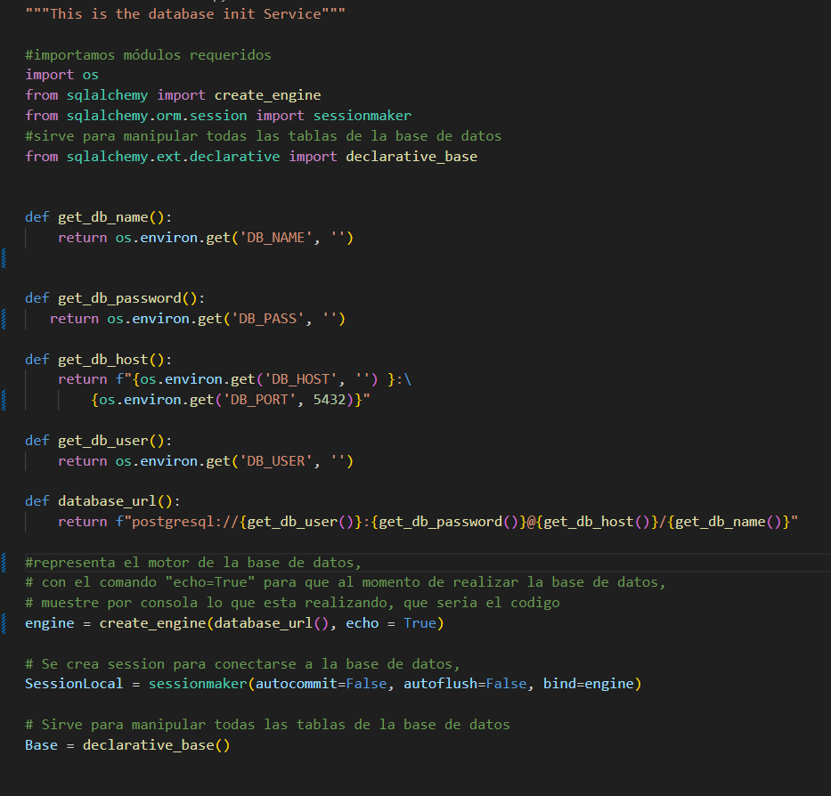
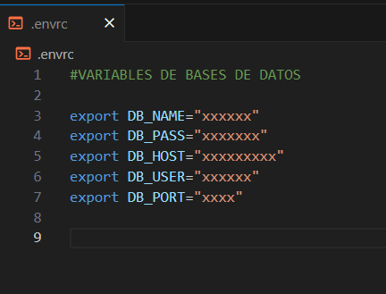
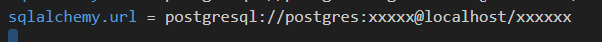
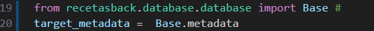
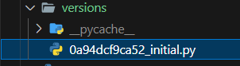
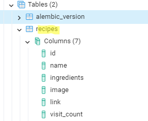
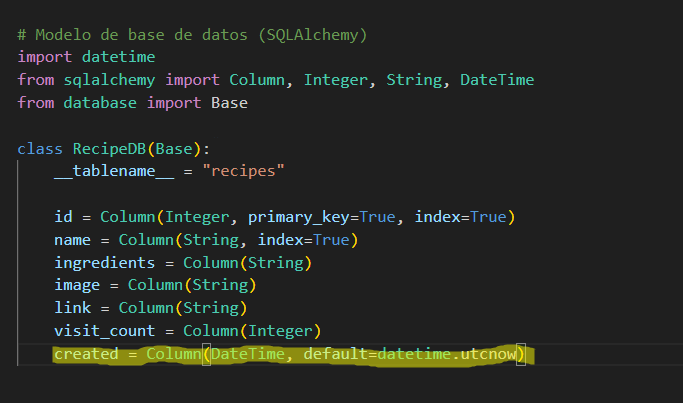
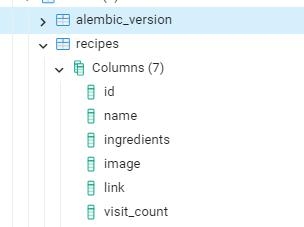

# food-api-service
## Implementar migraciones a DB

## **Instalación de dependencias**
### **Instalación con Poetry (recomendada)**
  Poetry es una herramienta de gestión de dependencias  y empaquetado para Python.
  En la terminal instalamos y configuramos poetry para el proyecto:
  ~~~
     poetry add
     poetry install
     poetry --version
     Para iniciar un nuevo entorno virtual: poetry shell 
  ~~~
 ### **Configuación de  SQLAlchemy**
   
   * ** Instalar extensión que permite visualizar los datos de una base de datos:
        SQLite viewer for VSCode

   * ** Instalar el módulo SQLAlchemy en la terminal
        install sqlalchemy
  
   * ** Importamos módulos requeridos: 
    import os
    from sqlalchemy import create_engine
    from sqlalchemy.ext.declarative import declarative_base

    * ** Configuración para conectarse a una base de datos:

    

    * ** Configuración de variables de entorno:
    Crear un archivo .envrc 

   
  
### **Inicialización de Alembic**

  Alembic es un marco de gestión de migraciones de bases de datos. Alembic garantiza que los esquemas de su base de datos reflejen con precisión los modelos de datos que define con SQLAlchemy. Puedes conocer más sobre Alembic con su documentación oficial:
  https://alembic.sqlalchemy.org/

  * **Configuración de Alembic
    En la terminal, y estando dentro de la carpeta del proyecto ejecutamos los siguiente comandos:
  
  - poetry install alambic sqlalchemy
  - alembic init migrations # "este comando crea una carpeta llamada migrations"
  - ls # para verificar los comandos 
  - ls migrations # "Verificamos que dentro de la carpeta migraciones se crea 'versions'
   En esta carpeta versions es donde se almacenan los archivos de migración 

   El siguiente paso es editar el archivo alembic.ini y configurarlo para que apunte a una
   base de datos específica. Para ello digitamos el comando:
   - nano alembic.ini

   Estando allí se busca una variable llamada: "sqlalchemy.url = " y colocamos la url de nuestra base de datos
   

   A continuación vamos a nuestro editor visual studio code para editar el archio 'env.py'. 
   Este archivo contiene un par de comandos que son los comandos que ejecutan la escena de 
   migración en la base de datos y que se necesita editar para que apunte a nuestra base de datos.
   

Una vez creados los modelos de nuestra base de datos, procedemos a la creación de migraciones desde la terminal.

  * **Creación de migraciones
  Lo primero que debemos hacer es crear el archivo de migraciones con el siguiente comando:
  - alembic revision --autogenerate -m "Descripción de la migración

  La migración se ha creado en la carpeta de versions,  y conviene revisar este archivo
  para confirmar que los cambios reflejan lo que se espera.
 

  * **Aplicar migraciones
  
Ahora es necesario aplicar la migración a la base de datos y para ellos ejecutamos el siguiente comando:
- alembic upgrade head

En caso de necesitar revertir una migración, se puede usar alembic downgrade -1

### **Pruebas**

Una vez realizado los pasos anteriores podemos revisar nuestra base de datos en postgres con los parámetros que se enviaron:

De esta manera ya es posible adicionar, eliminar, editar datos de nuestra tabla, por ejemplo podemos eliminar una columna
de nuestro modelo de base de datos, en este caso, se eliminará la última columna:

Y cuando revisemos nuestra base de datos en postgres / click derecho / refresh. 
Observamos que la columna se ha eliminado.

De esta manera podemos adicionar, o realizar modificaciones a nuestra base de datos.

